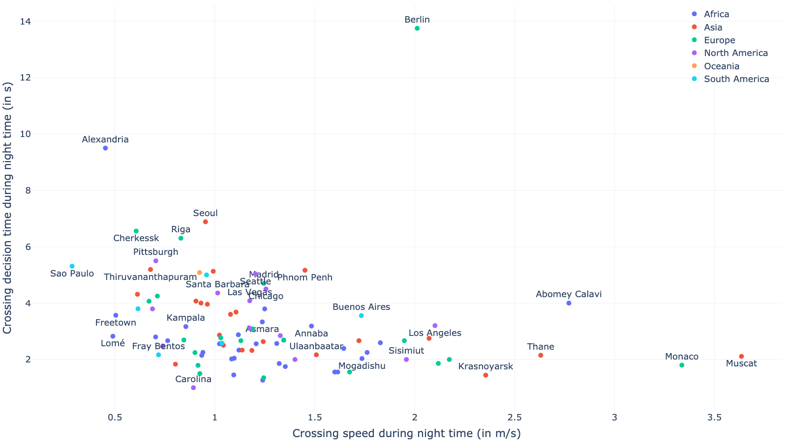
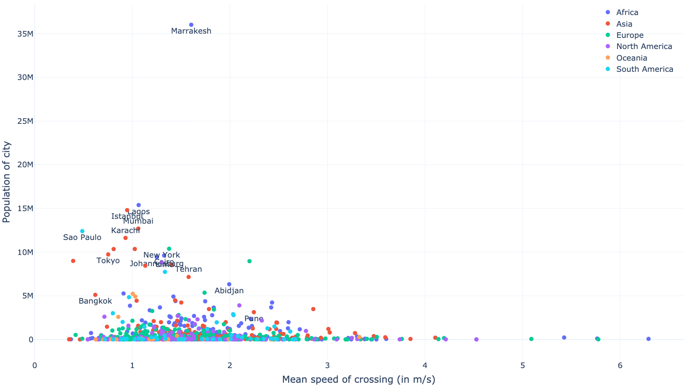
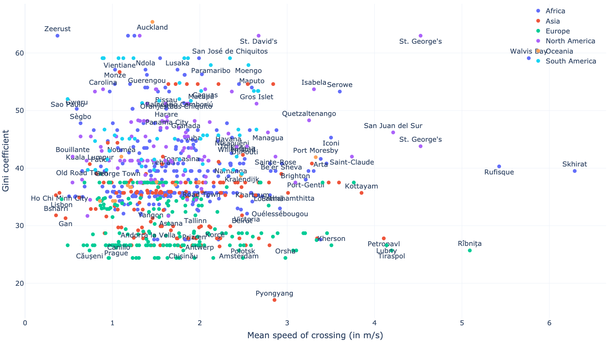
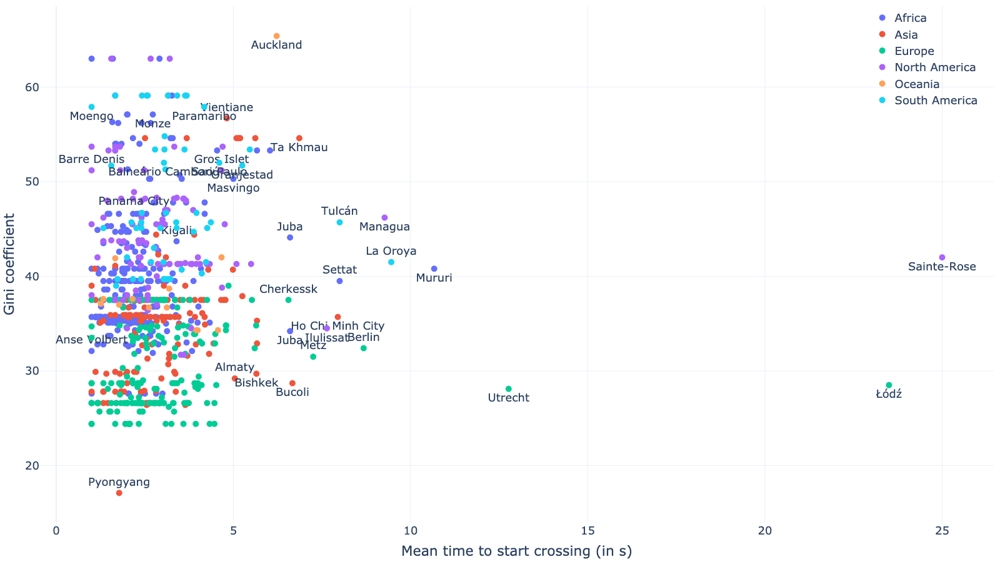
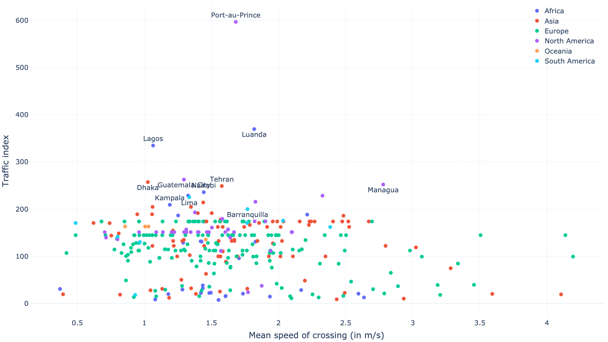
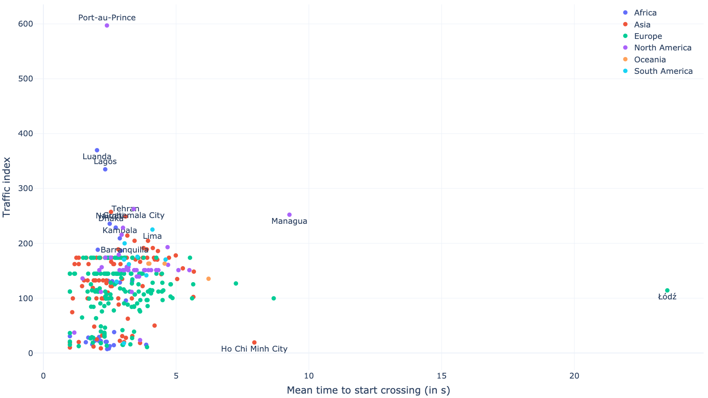
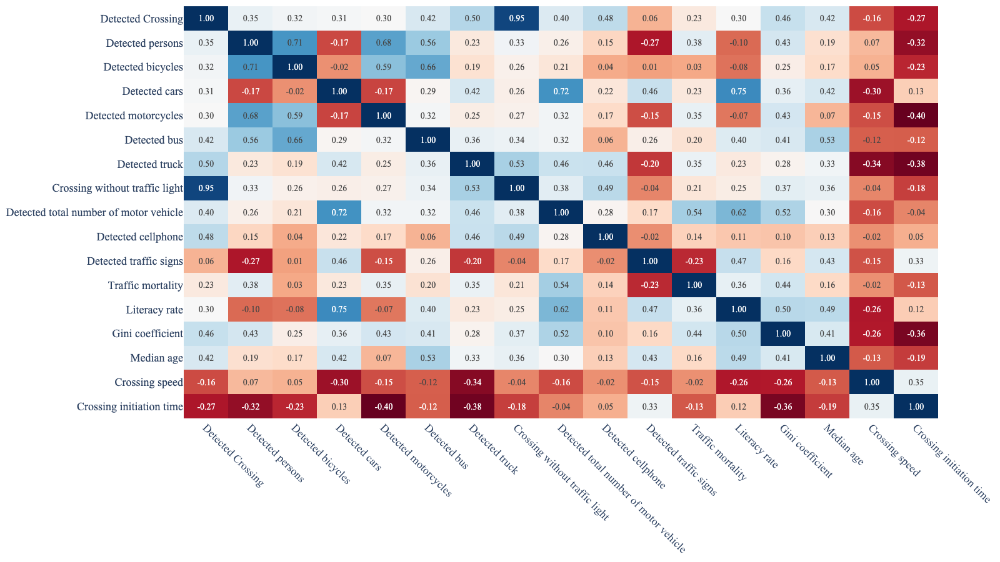
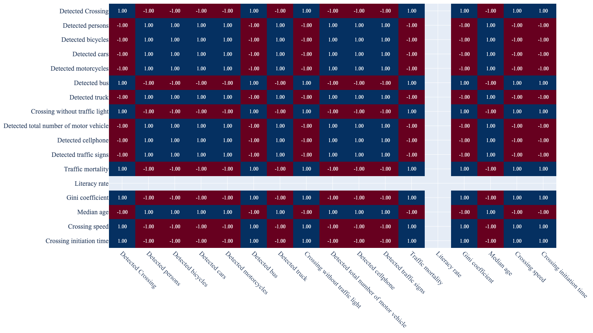

This repository contains code that extracts YouTube videos based on a mapping.csv file and performs object detection using YOLOv11. The primary objective of this work is to evaluate pedestrian behaviour in a cross-country or cross-cultural context using freely available YouTube videos.

This study presents a comprehensive cross-cultural evaluation of pedestrian behaviour during road crossings, examining variations between developed and developing states worldwide. As urban landscapes evolve and autonomous vehicles (AVs) become integral to future transportation, understanding pedestrian behaviour becomes paramount for ensuring safe interactions between humans and AVs. Through an extensive review of global pedestrian studies, we analyse key factors influencing crossing behaviour, such as cultural norms, socioeconomic factors, infrastructure development, and regulatory frameworks. Our findings reveal distinct patterns in pedestrian conduct across different regions. Developed states generally exhibit more structured and rule-oriented crossing behaviours, influenced by established traffic regulations and advanced infrastructure. In contrast, developing states often witness a higher degree of informal and adaptive behaviour due to limited infrastructure and diverse cultural influences. These insights underscore the necessity for AVs to adapt to diverse pedestrian behaviour on a global scale, emphasising the importance of incorporating cultural nuances into AV programming and decision-making algorithms. As the integration of AVs into urban environments accelerates, this research contributes valuable insights for enhancing the safety and efficiency of autonomous transportation systems. By recognising and accommodating diverse pedestrian behaviours, AVs can navigate complex and dynamic urban settings, ensuring a harmonious coexistence with human road users across the globe.

## Citation
If you use this work for academic work please cite the following paper:

> Alam, Md. S., Martens, M. H., & Bazilinskyy, P. (2025). Understanding global pedestrian behaviour in 361 cities with dashcam videos on YouTube. Under review. 

## Usage of the code
The code is open-source and free to use. It is aimed for, but not limited to, academic research. We welcome forking of this repository, pull requests, and any contributions in the spirit of open science and open-source code 😍😄 For inquiries about collaboration, you may contact Md Shadab Alam (md_shadab_alam@outlook.com) or Pavlo Bazilinskyy (pavlo.bazilinskyy@gmail.com).

## Getting Started
Tested with Python 3.9.19. To setup the environment run these two commands in a parent folder of the downloaded repository (replace `/` with `\` and possibly add `--user` if on Windows:

**Step 1:**
Clone the repository
```command line
git clone https://github.com/Shaadalam9/pedestrians-in-youtube.git
```

**Step 2:**
Create a new virtual environment
```command line
python -m venv venv
```

**Step 3:**
Activate the virtual environment
```command line
source venv/bin/activate
```

On Windows use
```command line
venv\Scripts\activate
```

**Step 4:**
Install dependencies
```command line
pip install -r requirements.txt
```

**Step 5:**
Ensure you have the required datasets in the data/ directory, including the mapping.csv file.

**Step 6:**
Run the code:
```command line
python3 analysis.py
```

- **`data`**: Directory containing data (CSV output from YOLO).
- **`videos`**: Directory containing the videos used to generate the data.
- **`mapping`**: CSV file that contains mapping data for the cities referenced in the data.
- **`prediction_mode`**: Configures YOLO for object detection.
- **`tracking_mode`**: Configures YOLO for object tracking.
- **`always_analyse`**: Always conduct analysis even when pickle files are present (good for testing).
- **`display_frame_tracking`**: Displays the frame tracking during analysis.
- **`save_annotated_img`**: Saves the annotated frames produced by YOLO.
- **`delete_labels`**: Deletes label files from YOLO output.
- **`delete_frames`**: Deletes frames from YOLO output.
- **`delete_youtube_video`**: Deletes saved YouTube videos.
- **`compress_youtube_video`**: Compresses YouTube videos (using the H.255 codec by default).
- **`delete_runs_files`**: Deletes files containing YOLO output after analysis.
- **`monitor_temp`**: Monitors the temperature of the device running the analysis.
- **`check_for_download_csv_file`**: Flag indicating whether any video listed in the mapping file is pending analysis.
- **`client`**: Specifies the client type for downloading YouTube videos; accepted values are `"WEB"`, `"ANDROID"` or `"ios"`.
- **`model`**: Specifies the YOLO model to use; supported/tested versions include `v8x` and `v11x`.
- **`countries_analyse`**: Lists the countries to be analysed.
- **`confidence`**: Sets the confidence threshold parameter for YOLO.
- **`update_ISO_code`**: Updates the ISO code of the country in the mapping file during analysis.
- **`update_pop_country`**: Updates the country’s population in the mapping file during analysis.
- **`update_continent`**: Updates the continent information in the mapping file during analysis.
- **`update_mortality_rate`**: Updates the mortality rate of the country in the mapping file during analysis.
- **`update_gini_value`**: Updates the GINI value of the country in the mapping file during analysis.
- **`update_upload_date`**: Updates the upload date of videos in the mapping file during analysis.
- **`update_fps_list`**: Updates the FPS (frames per second) information for videos in the mapping file during analysis.
- **`update_pytubefix`**: Updates the `pytubefix` library each time analysis starts.
- **`font_family`**: Specifies the font family to be used in outputs.
- **`plotly_template`**: Defines the template for Plotly figures.

## Example

Example of YOLO running on dashcam video (original video: https://www.youtube.com/watch?v=_Wyg213IZDI)
<a href="https://youtu.be/NipvoDg0Nyk">
  
</a>


## Selection procedure

### Videos were not selected if it skips frames
<a href="https://youtu.be/0K9vaQxKZ9k">
  
</a>

### Snippets of videos are not analysed during the movement of camera
<a href="https://youtu.be/3jVszt_78_k">
  
</a>

## Results

Countries where the study has been conducted
[](https://htmlpreview.github.io/?https://github.com/Shaadalam9/youtube-pedestrian/blob/main/figures/world_map.html)

Pedestrian crossing decision time (sorted by countries)
[](https://htmlpreview.github.io/?https://github.com/Shaadalam9/youtube-pedestrian/blob/main/figures/time_to_start_cross.html)

Speed of crossing(sorted by countries)
[](https://htmlpreview.github.io/?https://github.com/Shaadalam9/youtube-pedestrian/blob/main/figures/speed_of_crossing.html)

Pedestrian crossing decision time(sorted by average of day and night)
[](https://htmlpreview.github.io/?https://github.com/Shaadalam9/youtube-pedestrian/blob/main/figures/time_to_start_cross_by_avg.html)

Speed of crossing(sorted by average of day and night)
[](https://htmlpreview.github.io/?https://github.com/Shaadalam9/youtube-pedestrian/blob/main/figures/speed_of_crossing_by_avg.html)

Merged figure of the speed of crossing and Pedestrian crossing decision time(sorted by countries)
[](https://htmlpreview.github.io/?https://github.com/Shaadalam9/youtube-pedestrian/blob/main/figures/consolidated.html)

## Relationship between computed and statistical metrics
[](https://htmlpreview.github.io/?https://github.com/Shaadalam9/youtube-pedestrian/blob/main/figures//scatter_speed_crossing-time_crossing.html)
Pedestrian crossing speed over pedestrian crossing decision time.

[](https://htmlpreview.github.io/?https://github.com/Shaadalam9/youtube-pedestrian/blob/main/figures//scatter_speed_crossing_daytime_crossing_day.html)
Pedestrian crossing speed over pedestrian crossing decision time, during daytime.

[](https://htmlpreview.github.io/?https://github.com/Shaadalam9/youtube-pedestrian/blob/main/figures//scatter_speed_crossing_night-time_crossing_night.html)
Pedestrian crossing speed over pedestrian crossing decision time, during night time.

[](https://htmlpreview.github.io/?https://github.com/Shaadalam9/youtube-pedestrian/blob/main/figures//scatter_speed_crossing-population_city.html)
Pedestrian crossing speed over population of city.

[](https://htmlpreview.github.io/?https://github.com/Shaadalam9/youtube-pedestrian/blob/main/figures//scatter_time_crossing-population_city.html)
Pedestrian crossing decision time over population of city.

[](https://htmlpreview.github.io/?https://github.com/Shaadalam9/youtube-pedestrian/blob/main/figures//scatter_speed_crossing-traffic_mortality.html)
Pedestrian crossing speed over traffic mortality.

[](https://htmlpreview.github.io/?https://github.com/Shaadalam9/youtube-pedestrian/blob/main/figures//scatter_time_crossing-traffic_mortality.html)
Pedestrian crossing decision time over traffic mortality.

[](https://htmlpreview.github.io/?https://github.com/Shaadalam9/youtube-pedestrian/blob/main/figures//scatter_speed_crossing-literacy_rate.html)
Pedestrian crossing speed over literacy rate.

[](https://htmlpreview.github.io/?https://github.com/Shaadalam9/youtube-pedestrian/blob/main/figures//scatter_time_crossing-literacy_rate.html)
Pedestrian crossing decision time over literacy rate.

[](https://htmlpreview.github.io/?https://github.com/Shaadalam9/youtube-pedestrian/blob/main/figures//scatter_speed_crossing-gini.html)
Pedestrian crossing speed over Gini coefficient.

[](https://htmlpreview.github.io/?https://github.com/Shaadalam9/youtube-pedestrian/blob/main/figures//scatter_time_crossing-gini.html)
Pedestrian crossing decision time over Gini coefficient.

[](https://htmlpreview.github.io/?https://github.com/Shaadalam9/youtube-pedestrian/blob/main/figures//scatter_speed_crossing-traffic_index.html)
Pedestrian crossing speed over traffic index.

[](https://htmlpreview.github.io/?https://github.com/Shaadalam9/youtube-pedestrian/blob/main/figures//scatter_time_crossing-traffic_index.html)
Pedestrian crossing decision time over traffic index.


## Correlation matrices
[](https://htmlpreview.github.io/?https://github.com/Shaadalam9/youtube-pedestrian/blob/main/figures/correlation_matrix_heatmap_averaged.html)
Correlation matrix.

[](https://htmlpreview.github.io/?https://github.com/Shaadalam9/youtube-pedestrian/blob/main/figures/correlation_matrix_heatmap_in_daylight.html)
Correlation matrix at daytime.

[](https://htmlpreview.github.io/?https://github.com/Shaadalam9/youtube-pedestrian/blob/main/figures/correlation_matrix_heatmap_in_night.html)
Correlation matrix at night time.

[](https://htmlpreview.github.io/?https://github.com/Shaadalam9/youtube-pedestrian/blob/main/figures/correlation_matrix_heatmap_Africa.html)
Correlation matrix for Africa.

[](https://htmlpreview.github.io/?https://github.com/Shaadalam9/youtube-pedestrian/blob/main/figures/correlation_matrix_heatmap_Asia.html)
Correlation matrix for Asia.

[](https://htmlpreview.github.io/?https://github.com/Shaadalam9/youtube-pedestrian/blob/main/figures/correlation_matrix_heatmamp_Oceania.html)
Correlation matrix for Oceania.
.
[](https://htmlpreview.github.io/?https://github.com/Shaadalam9/youtube-pedestrian/blob/main/figures/correlation_matrix_heatmap_Europe.html)
Correlation matrix for Europe.

[](https://htmlpreview.github.io/?https://github.com/Shaadalam9/youtube-pedestrian/blob/main/figures/correlation_matrix_heatmap_North%20America.html)
Correlation matrix for North America.

[](https://htmlpreview.github.io/?https://github.com/Shaadalam9/youtube-pedestrian/blob/main/figures/correlation_matrix_heatmap_South%20America.html)
Correlation matrix for South America.

## Contact
If you have any questions or suggestions, feel free to reach out to md_shadab_alam@outlook.com or pavlo.bazilinskyy@gmail.com.

## License
This project is licensed under the MIT License - see the LICENSE file for details.
