This repository contains code that extracts YouTube videos based on a mapping.csv file and performs object detection using YOLOv11. The primary objective of this work is to evaluate pedestrian behaviour in a cross-country or cross-cultural context using freely available YouTube videos.

This study presents a comprehensive cross-cultural evaluation of pedestrian behaviour during road crossings, examining variations between developed and developing states worldwide. As urban landscapes evolve and autonomous vehicles (AVs) become integral to future transportation, understanding pedestrian behaviour becomes paramount for ensuring safe interactions between humans and AVs. Through an extensive review of global pedestrian studies, we analyse key factors influencing crossing behaviour, such as cultural norms, socioeconomic factors, infrastructure development, and regulatory frameworks. Our findings reveal distinct patterns in pedestrian conduct across different regions. Developed states generally exhibit more structured and rule-oriented crossing behaviours, influenced by established traffic regulations and advanced infrastructure. In contrast, developing states often witness a higher degree of informal and adaptive behaviour due to limited infrastructure and diverse cultural influences. These insights underscore the necessity for AVs to adapt to diverse pedestrian behaviour on a global scale, emphasising the importance of incorporating cultural nuances into AV programming and decision-making algorithms. As the integration of AVs into urban environments accelerates, this research contributes valuable insights for enhancing the safety and efficiency of autonomous transportation systems. By recognising and accommodating diverse pedestrian behaviours, AVs can navigate complex and dynamic urban settings, ensuring a harmonious coexistence with human road users across the globe.

The dataset is available on [kaggle](https://www.kaggle.com/datasets/anonymousauthor123/pedestrian-in-youtubepyt).

## Citation
If you use this work for academic work please cite the following paper:

> Alam, Md. S., Martens, M. H., & Bazilinskyy, P. (2025). Understanding global pedestrian behaviour in 361 cities with dashcam videos on YouTube. Under review. Available at https://bazilinskyy.github.io/publications/alam2025crossing

## Usage of the code
The code is open-source and free to use. It is aimed for, but not limited to, academic research. We welcome forking of this repository, pull requests, and any contributions in the spirit of open science and open-source code 😍😄 For inquiries about collaboration, you may contact Md Shadab Alam (md_shadab_alam@outlook.com) or Pavlo Bazilinskyy (pavlo.bazilinskyy@gmail.com).

## Running analysis code
Tested with Python 3.9.19. To setup the environment run these two commands in a parent folder of the downloaded repository (replace `/` with `\` and possibly add `--user` if on Windows:

**Step 1:**
Clone the repository
```command line
git clone https://github.com/Shaadalam9/pedestrians-in-youtube.git
```

**Step 2:**
Create a new virtual environment
```command line
python -m venv venv
```

**Step 3:**
Activate the virtual environment
```command line
source venv/bin/activate
```

On Windows use
```command line
venv\Scripts\activate
```

**Step 4:**
Install dependencies
```command line
pip install -r requirements.txt
```

**Step 5:**
Ensure you have the required datasets in the data/ directory, including the mapping.csv file.

**Step 6:**
Run the code:
```command line
python3 analysis.py
```

### Configuration of project
Configuration of the project needs to be defined in `config`. Please use the `default.config` file for the required structure of the file. If no custom config file is provided, `default.config` is used. The config file has the following parameters:
- **`data`**: Directory containing data (CSV output from YOLO).
- **`videos`**: Directory containing the videos used to generate the data.
- **`mapping`**: CSV file that contains mapping data for the cities referenced in the data.
- **`prediction_mode`**: Configures YOLO for object detection.
- **`tracking_mode`**: Configures YOLO for object tracking.
- **`always_analyse`**: Always conduct analysis even when pickle files are present (good for testing).
- **`display_frame_tracking`**: Displays the frame tracking during analysis.
- **`save_annotated_img`**: Saves the annotated frames produced by YOLO.
- **`delete_labels`**: Deletes label files from YOLO output.
- **`delete_frames`**: Deletes frames from YOLO output.
- **`delete_youtube_video`**: Deletes saved YouTube videos.
- **`compress_youtube_video`**: Compresses YouTube videos (using the H.255 codec by default).
- **`delete_runs_files`**: Deletes files containing YOLO output after analysis.
- **`monitor_temp`**: Monitors the temperature of the device running the analysis.
- **`check_for_download_csv_file`**: Flag indicating whether any video listed in the mapping file is pending analysis.
- **`client`**: Specifies the client type for downloading YouTube videos; accepted values are `"WEB"`, `"ANDROID"` or `"ios"`.
- **`model`**: Specifies the YOLO model to use; supported/tested versions include `v8x` and `v11x`.
- **`countries_analyse`**: Lists the countries to be analysed.
- **`confidence`**: Sets the confidence threshold parameter for YOLO.
- **`update_ISO_code`**: Updates the ISO code of the country in the mapping file during analysis.
- **`update_pop_country`**: Updates the country’s population in the mapping file during analysis.
- **`update_continent`**: Updates the continent information in the mapping file during analysis.
- **`update_mortality_rate`**: Updates the mortality rate of the country in the mapping file during analysis.
- **`update_gini_value`**: Updates the GINI value of the country in the mapping file during analysis.
- **`update_upload_date`**: Updates the upload date of videos in the mapping file during analysis.
- **`update_fps_list`**: Updates the FPS (frames per second) information for videos in the mapping file during analysis.
- **`update_pytubefix`**: Updates the `pytubefix` library each time analysis starts.
- **`font_family`**: Specifies the font family to be used in outputs.
- **`font_size`**: Specifies the font size to be used in outputs.
- **`plotly_template`**: Defines the template for Plotly figures.

For working with external APIs of [GeoNames](https://www.geonames.org) and [BEA](https://apps.bea.gov/api/signup), the API keys need to be placed in file `secret` (no extension) in the root of the project. The file needs to be formatted as `secret example`. This is optional for just running the analysis on the dataset. 

### Adding videos to dataset
To add more videos to the the `mapping` file, run `python add_video.py`. It is Flask we form which allows to add new videos for a city. The form understands if the city is already present in the dataset and adds a new videos to the existing row in the mapping file. Providing state is optional, and is recommended for US and Canada. Providing country is mandatory.

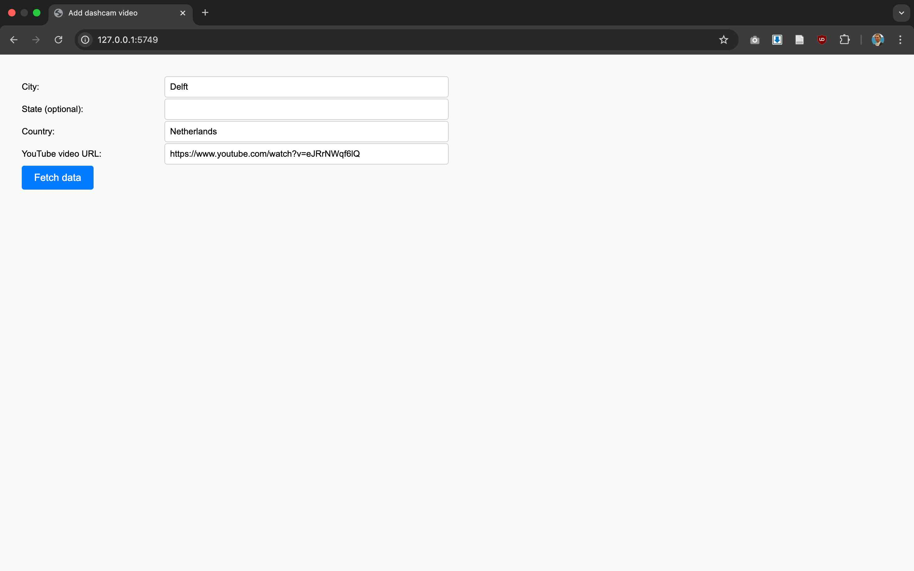
Adding new video to a city. In the case for Delft, Netherlands (with state not mentioned).

For each video, it is possible to add multiple segments (parts of the video). To add a new segment/video, it is mandatory to add the following information: `Time of day`, `Vehicle`, `Start time (in seconds)` (a counter of the current second is shown under the embedded video), `End time (seconds)` (it must be larger than the starting time), and `FPS` (to see the FPS of the video, click with secondary mouse button on the video and go to "Stats for nerds"🤓; FPS value is shown as a value following the resolution, e.g. "1920x1080@30"). All other values are attempted to be fetched automatically from various APIs and by analysing the video. All values can be adjusted by hand in the `mapping` file in case of mistakes/missing information.

Each video can contain multiple segments (with each new segment starting at the same timestamp as the end of the previous segment or later). All video-level values (including FPS) do not have to be updated for each new segment (i.e., only start and end, time of day, and vehicle type of each new segment shall be provided).

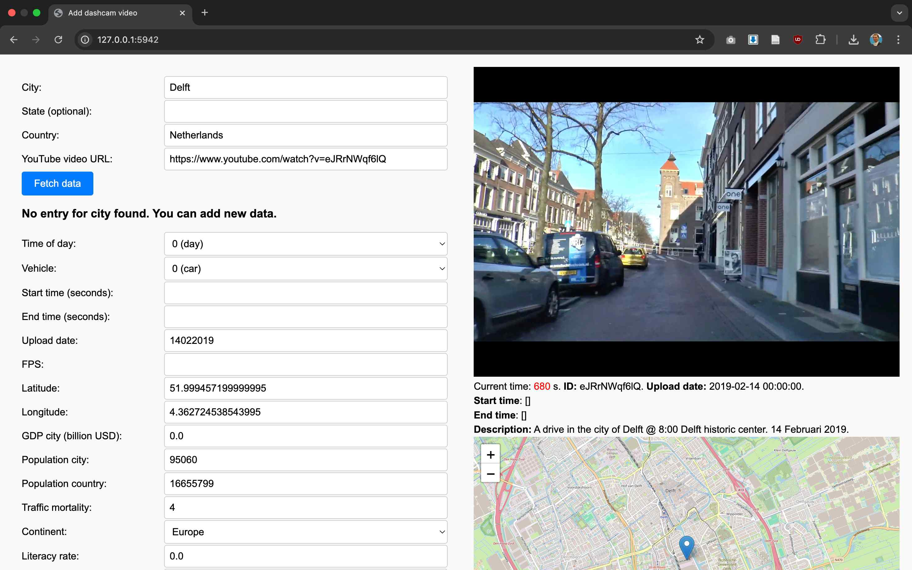
Form understands that there is no entry for Delft, Netherlands in the mapping file yet and allows to add the first video for that city.

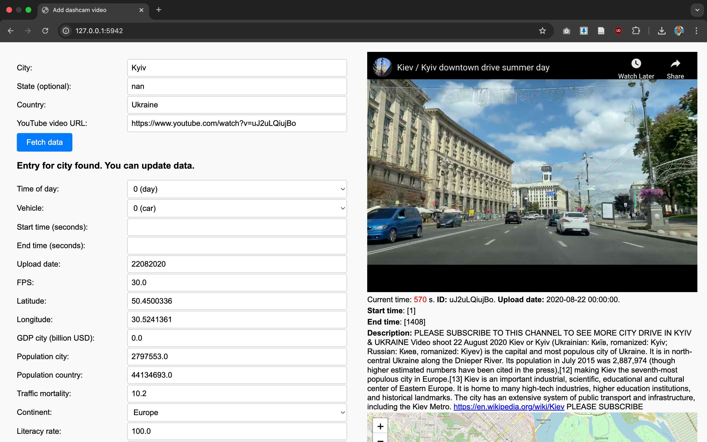
If the city already exists in data, the form extends the entry for that city with the new video. In this example, a new video is added to Kyiv, Ukraine.

## Example of YOLO running on a dashcam video

<a href="https://youtu.be/NipvoDg0Nyk">
  
</a>

Video: [https://www.youtube.com/watch?v=_Wyg213IZDI](https://www.youtube.com/watch?v=_Wyg213IZDI).

## Selection procedure

### Segments of videos were not selected if frames are skipped
<a href="https://youtu.be/0K9vaQxKZ9k">
  
</a>

Video: [https://www.youtube.com/watch?v=0K9vaQxKZ9k](https://www.youtube.com/watch?v=0K9vaQxKZ9k).

### Snippets of videos are not analysed during the movement of camera
<a href="https://youtu.be/3jVszt_78_k">
  
</a>

Video: [https://www.youtube.com/watch?v=3jVszt_78_k](https://www.youtube.com/watch?v=3jVszt_78_k).

## Description and analysis of dataset
### Description of dataset
<!-- [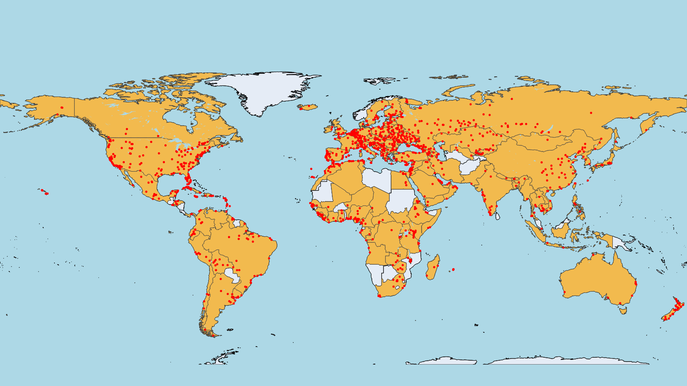](https://htmlpreview.github.io/?https://github.com/Shaadalam9/youtube-pedestrian/blob/main/figures/world_map.html)
Locations of cities with footage in dataset. -->

[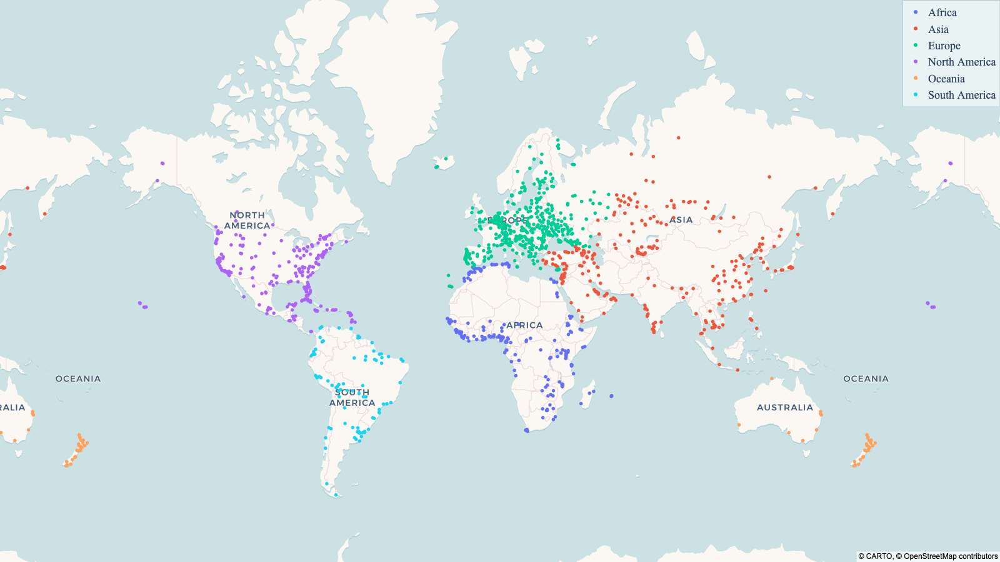](https://htmlpreview.github.io/?https://github.com/Shaadalam9/youtube-pedestrian/blob/main/figures/mapbox_map.html)
Locations of cities with footage in dataset.

<!-- [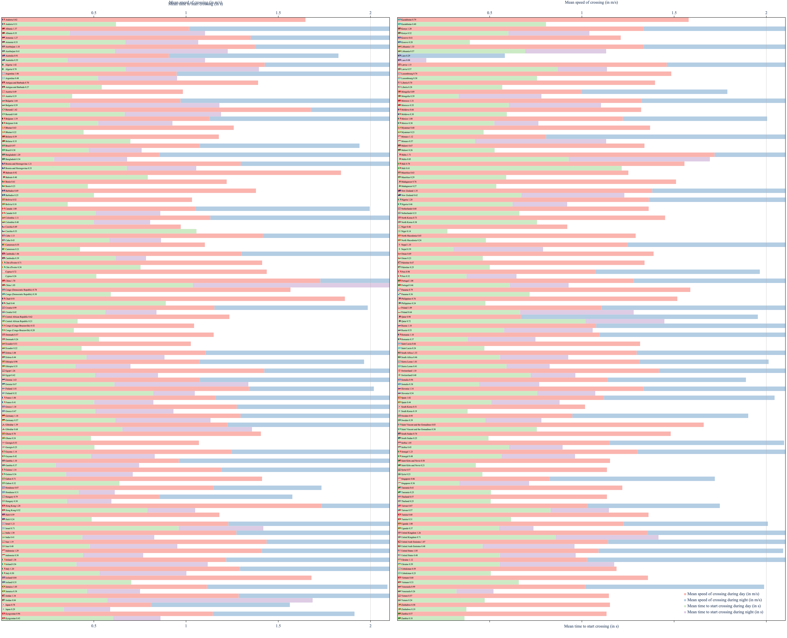](https://htmlpreview.github.io/?https://github.com/Shaadalam9/youtube-pedestrian/blob/main/figures/consolidated.html)
Crossing decision time and crossing speed (sorted by countries). -->

[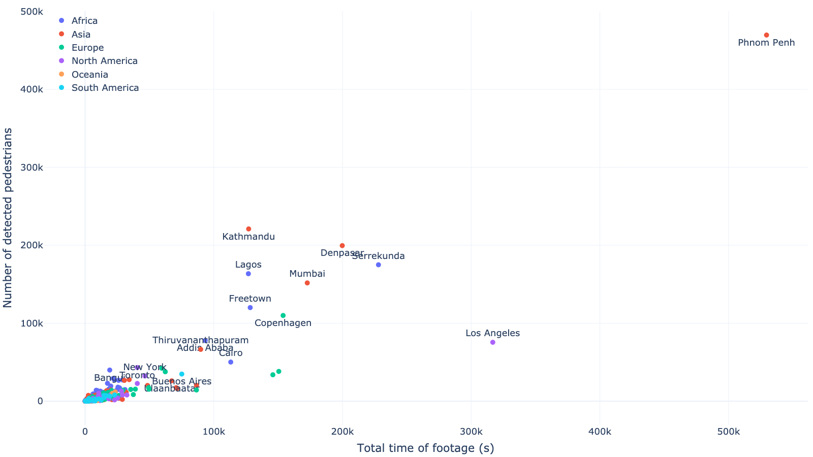](https://htmlpreview.github.io/?https://github.com/Shaadalam9/youtube-pedestrian/blob/main/figures/scatter_total_time-person.html)
Total time of footage over number of detected pedestrians.

### Global behaviour of pedestrians
[](https://htmlpreview.github.io/?https://github.com/Shaadalam9/youtube-pedestrian/blob/main/figures/time_crossing_alphabetical.html)
Crossing decision time (sorted by countries).

[](https://htmlpreview.github.io/?https://github.com/Shaadalam9/youtube-pedestrian/blob/main/figures/crossing_speed_alphabetical.html)
Crossing speed (sorted by countries).

[](https://htmlpreview.github.io/?https://github.com/Shaadalam9/youtube-pedestrian/blob/main/figures/time_crossing_avg.html)
Crossing decision time (sorted by average of day and night).

[](https://htmlpreview.github.io/?https://github.com/Shaadalam9/youtube-pedestrian/blob/main/figures/crossing_speed_avg.html)
Crossing speed (sorted by average of day and night).

### Relationship between computed and statistical metrics
[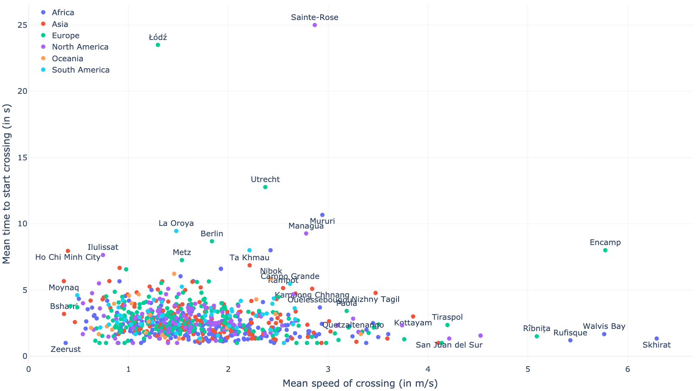](https://htmlpreview.github.io/?https://github.com/Shaadalam9/youtube-pedestrian/blob/main/figures/scatter_speed_crossing-time_crossing.html)
Crossing speed over crossing decision time.

[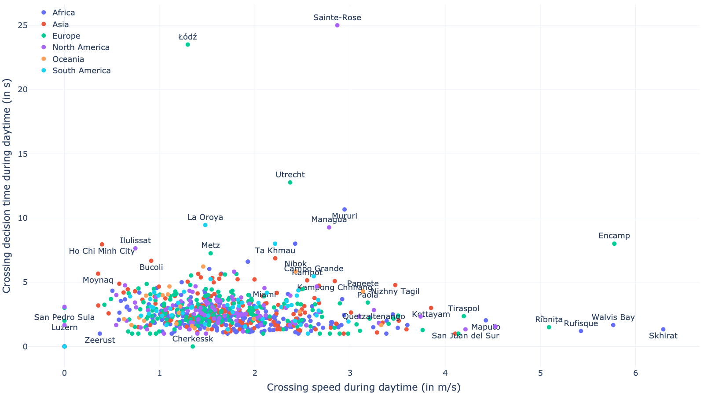](https://htmlpreview.github.io/?https://github.com/Shaadalam9/youtube-pedestrian/blob/main/figures/scatter_speed_crossing_day-time_crossing_day.html)
Crossing speed over crossing decision time, during daytime.

[](https://htmlpreview.github.io/?https://github.com/Shaadalam9/youtube-pedestrian/blob/main/figures/scatter_speed_crossing_night-time_crossing_night.html)
Crossing speed over crossing decision time, during night time.

[](https://htmlpreview.github.io/?https://github.com/Shaadalam9/youtube-pedestrian/blob/main/figures/scatter_speed_crossing-population_city.html)
Crossing speed over population of city.

[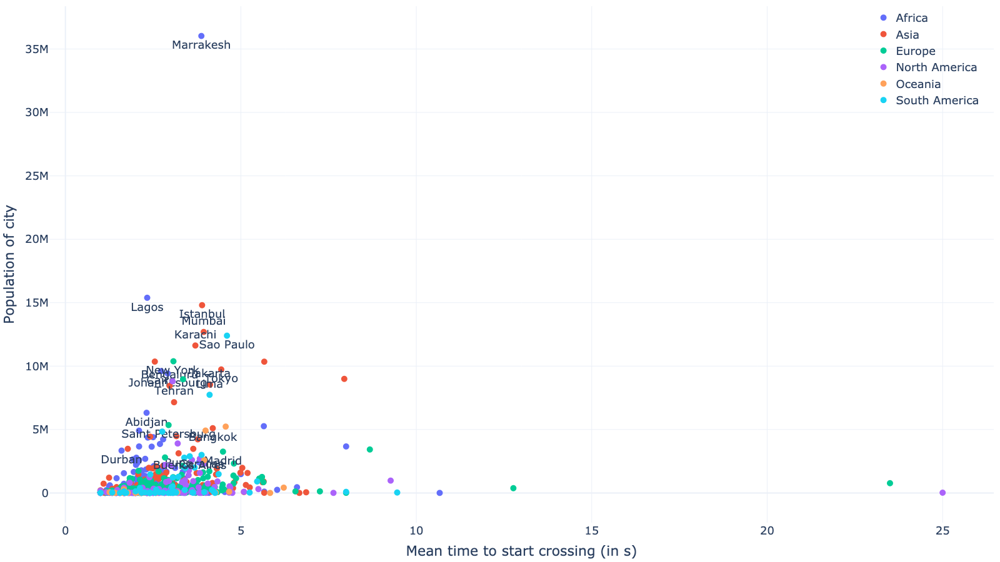](https://htmlpreview.github.io/?https://github.com/Shaadalam9/youtube-pedestrian/blob/main/figures/scatter_time_crossing-population_city.html)
Crossing decision time over population of city.

[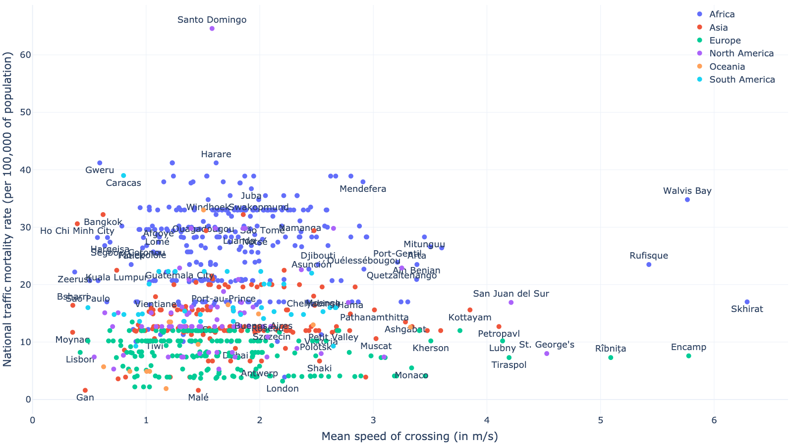](https://htmlpreview.github.io/?https://github.com/Shaadalam9/youtube-pedestrian/blob/main/figures/scatter_speed_crossing-traffic_mortality.html)
Crossing speed over traffic mortality.

[](https://htmlpreview.github.io/?https://github.com/Shaadalam9/youtube-pedestrian/blob/main/figures/scatter_time_crossing-traffic_mortality.html)
Crossing decision time over traffic mortality.

[](https://htmlpreview.github.io/?https://github.com/Shaadalam9/youtube-pedestrian/blob/main/figures/scatter_speed_crossing-literacy_rate.html)
Crossing speed over literacy rate.

[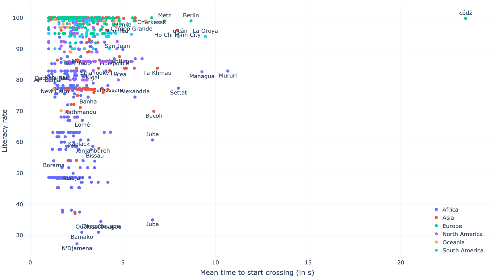](https://htmlpreview.github.io/?https://github.com/Shaadalam9/youtube-pedestrian/blob/main/figures/scatter_time_crossing-literacy_rate.html)
Crossing decision time over literacy rate.

[](https://htmlpreview.github.io/?https://github.com/Shaadalam9/youtube-pedestrian/blob/main/figures/scatter_speed_crossing-gini.html)
Crossing speed over Gini coefficient.

[](https://htmlpreview.github.io/?https://github.com/Shaadalam9/youtube-pedestrian/blob/main/figures/scatter_time_crossing-gini.html)
Crossing decision time over Gini coefficient.

[](https://htmlpreview.github.io/?https://github.com/Shaadalam9/youtube-pedestrian/blob/main/figures/scatter_speed_crossing-traffic_index.html)
Crossing speed over traffic index.

[](https://htmlpreview.github.io/?https://github.com/Shaadalam9/youtube-pedestrian/blob/main/figures/scatter_time_crossing-traffic_index.html)
Crossing decision time over traffic index.

[](https://htmlpreview.github.io/?https://github.com/Shaadalam9/youtube-pedestrian/blob/main/figures/scatter_time_crossing-traffic_index.html)
Crossing decision time over traffic index.

### Correlation matrices
[](https://htmlpreview.github.io/?https://github.com/Shaadalam9/youtube-pedestrian/blob/main/figures/correlation_matrix_heatmap_averaged.html)
Correlation matrix.

[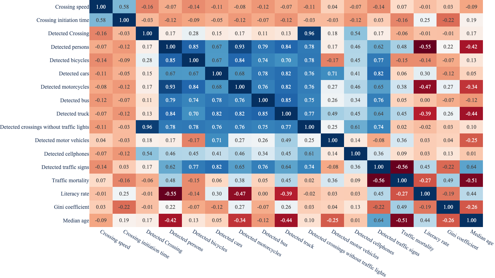](https://htmlpreview.github.io/?https://github.com/Shaadalam9/youtube-pedestrian/blob/main/figures/correlation_matrix_heatmap_day.html)
Correlation matrix at daytime.

[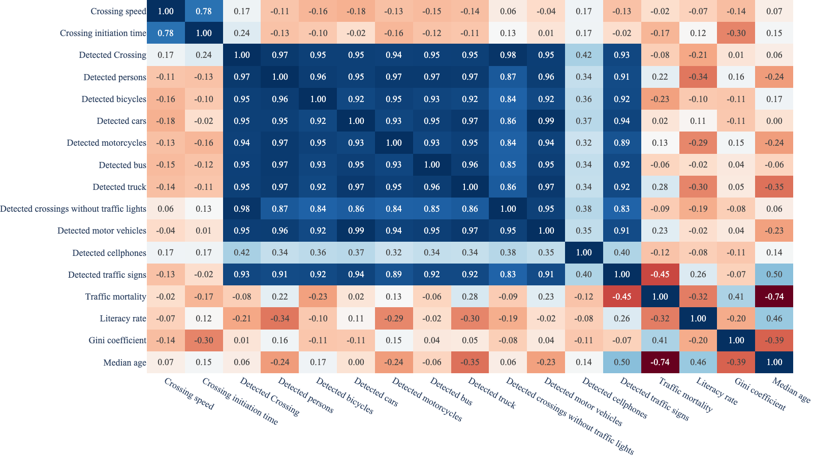](https://htmlpreview.github.io/?https://github.com/Shaadalam9/youtube-pedestrian/blob/main/figures/correlation_matrix_heatmap_night.html)
Correlation matrix at night time.

[](https://htmlpreview.github.io/?https://github.com/Shaadalam9/youtube-pedestrian/blob/main/figures/correlation_matrix_heatmap_Africa.html)
Correlation matrix for Africa.

[](https://htmlpreview.github.io/?https://github.com/Shaadalam9/youtube-pedestrian/blob/main/figures/correlation_matrix_heatmap_Asia.html)
Correlation matrix for Asia.

[](https://htmlpreview.github.io/?https://github.com/Shaadalam9/youtube-pedestrian/blob/main/figures/correlation_matrix_heatmamp_Oceania.html)
Correlation matrix for Oceania.

[](https://htmlpreview.github.io/?https://github.com/Shaadalam9/youtube-pedestrian/blob/main/figures/correlation_matrix_heatmap_Europe.html)
Correlation matrix for Europe.

[](https://htmlpreview.github.io/?https://github.com/Shaadalam9/youtube-pedestrian/blob/main/figures/correlation_matrix_heatmap_North%20America.html)
Correlation matrix for North America.

[](https://htmlpreview.github.io/?https://github.com/Shaadalam9/youtube-pedestrian/blob/main/figures/correlation_matrix_heatmap_South%20America.html)
Correlation matrix for South America.

### Analysis of pedestrian crossing road with and without traffic lights (jaywalking)
[](https://htmlpreview.github.io/?https://github.com/Shaadalam9/youtube-pedestrian/blob/main/figures/crossings_with_traffic_equipment_avg.html)
Road crossings with traffic signals (normalised over time and number of detected pedestrians).

[](https://htmlpreview.github.io/?https://github.com/Shaadalam9/youtube-pedestrian/blob/main/figures/crossings_without_traffic_equipment_avg.html)
Road crossings without traffic signals (normalised over time and number of detected pedestrians).

[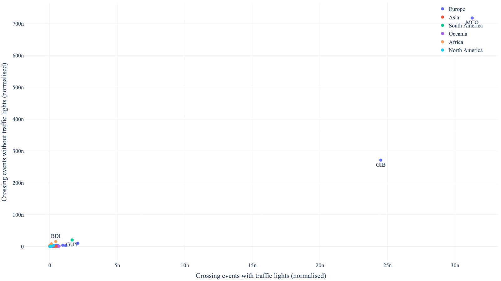](https://htmlpreview.github.io/?https://github.com/Shaadalam9/youtube-pedestrian/blob/main/figures/scatter_with_trf_light_norm-without_trf_light_norm.html)
Road crossings with and without traffic signals (normalised over time and number of detected pedestrians).

## Contact
If you have any questions or suggestions, feel free to reach out to md_shadab_alam@outlook.com or pavlo.bazilinskyy@gmail.com.

## License
This project is licensed under the MIT License - see the LICENSE file for details.
