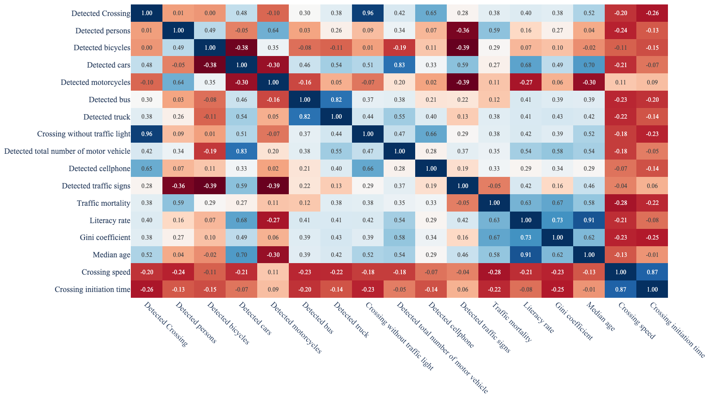
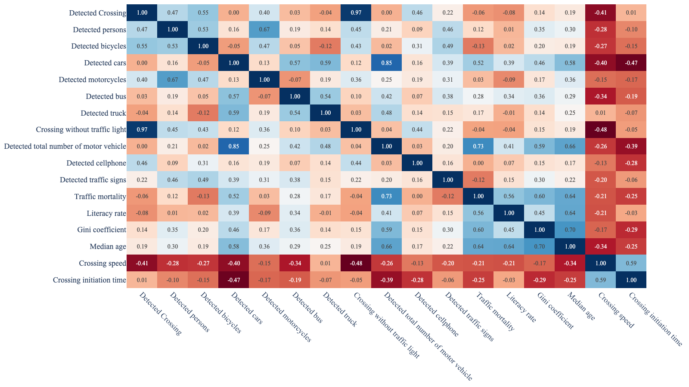

# youtube-pedestrian

## Overview
Welcome to the YOLOv8 YouTube Video Analysis project! This repository contains code that extracts YouTube videos based on a mapping.csv file and performs object detection using YOLOv8. The primary objective of this work is to evaluate pedestrian behavior in a cross-country or cross-cultural context using freely available YouTube videos.

This study presents a comprehensive cross-cultural evaluation of pedestrian behavior during road crossings, examining variations between developed and developing states worldwide. As urban landscapes evolve and autonomous vehicles (AVs) become integral to future transportation, understanding pedestrian behavior becomes paramount for ensuring safe interactions between humans and AVs. Through an extensive review of global pedestrian studies, we analyze key factors influencing crossing behavior, such as cultural norms, socioeconomic factors, infrastructure development, and regulatory frameworks. Our findings reveal distinct patterns in pedestrian conduct across different regions. Developed states generally exhibit more structured and rule-oriented crossing behaviors, influenced by established traffic regulations and advanced infrastructure. In contrast, developing states often witness a higher degree of informal and adaptive behavior due to limited infrastructure and diverse cultural influences. These insights underscore the necessity for AVs to adapt to diverse pedestrian behaviors on a global scale, emphasizing the importance of incorporating cultural nuances into AV programming and decision-making algorithms. As the integration of AVs into urban environments accelerates, this research contributes valuable insights for enhancing the safety and efficiency of autonomous transportation systems. By recognizing and accommodating diverse pedestrian behaviors, AVs can navigate complex and dynamic urban settings, ensuring a harmonious coexistence with human road users across the globe.

## Usage of the code
The code is open-source and free to use. It is aimed for, but not limited to, academic research. We welcome forking of this repository, pull requests, and any contributions in the spirit of open science and open-source code 😍😄 For inquiries about collaboration, you may contact Md Shadab Alam (md_shadab_alam@outlook.com) or Pavlo Bazilinskyy (pavlo.bazilinskyy@gmail.com).

## Getting Started
Tested with Python 3.9.19. To setup the environment run these two commands in a parent folder of the downloaded repository (replace `/` with `\` and possibly add `--user` if on Windows:

**Step 1:**
Clone the repository
```command line
git clone https://github.com/Shaadalam9/pedestrians-in-youtube.git
```

**Step 2:**
Create a new virtual environment
```command line
python -m venv venv
```

**Step 3:**
Activate the virtual environment
```command line
source venv/bin/activate
```

On Windows use
```command line
venv\Scripts\activate
```

**Step 4:**
Install dependencies
```command line
pip install -r requirements.txt
```

**Step 5:**
Ensure you have the required datasets in the data/ directory, including the mapping.csv file.

**Step 6:**
Run the code:
```command line
python3 analysis.py
```

### Configuration of project
Configuration of the project needs to be defined in `config`. Please use the `default.config` file for the required structure of the file. If no custom config file is provided, `default.config` is used. The config file has the following parameters:
* `data`: folder with data (CSV output of YOLO).
* `videos`: folder with videos that were used used to produce output in data.
* `mapping`: CSV file that contains all data for the cities in data.
* `prediction_mode`: 
* `tracking_mode`: 
* `display_frame_tracking`: 
* `save_annoted_img`: 
* `delete_labels`: delete labels from YOLO output.
* `delete_frames`: delete frames from YOLO output.
* `delete_youtube_video`: delete saved video.
* `compress_youtube_video`: compress YouTube videos (with H.255 codec by default).
* `delete_runs_files`: delete files with YOLO output after analysis.
* `monitor_temp`: monitor temperature of device that is running analysis.
* `check_for_download_csv_file`: 
* `client`: type of client for downloading YouTube videos: "WEB" or "ANDREOID".
* `model`: model of YOLO, supported/tested: v8 and v11.
* `countries_analyse`: countries to analyse.
* `confidence`: confidence parameter for YOLO.
* `update_ISO_code`: update ISO code of country in mapping file during analysis.
* `update_pop_country`: update population of country in mapping file during analysis.
* `update_continent`: update continent of country in mapping file during analysis.
* `update_mortality_rate`: update mortality rate of country in mapping file during analysis.
* `update_gini_value`: update GINI value of country in mapping file during analysis.
* `update_upload_date`: update upload date of videos in mapping file during analysis.
* `update_fps_list`: update FPS of videos in mapping file during analysis.
* `update_pytubefix`: update pytubefix library every time analysis stars.
* `font_family`: font family in outputs,
* `plotly_template`: template for plotly figures.

## Example
https://github.com/Shaadalam9/youtube-pedestrian/assets/88769183/5303f4a5-52a2-4230-bd05-89a53927a5be


## Results

Countries where the study has been conducted
[](https://htmlpreview.github.io/?https://github.com/Shaadalam9/youtube-pedestrian/blob/main/figures/world_map.html)

Time to start crossing(sorted by countries)
[](https://htmlpreview.github.io/?https://github.com/Shaadalam9/youtube-pedestrian/blob/main/figures/time_to_start_cross.html)

Speed of crossing(sorted by countries)
[](https://htmlpreview.github.io/?https://github.com/Shaadalam9/youtube-pedestrian/blob/main/figures/speed_of_crossing.html)

Time to start crossing(sorted by average of day and night)
[](https://htmlpreview.github.io/?https://github.com/Shaadalam9/youtube-pedestrian/blob/main/figures/time_to_start_cross_by_avg.html)

Speed of crossing(sorted by average of day and night)
[](https://htmlpreview.github.io/?https://github.com/Shaadalam9/youtube-pedestrian/blob/main/figures/speed_of_crossing_by_avg.html)

Merged figure of the speed of crossing and time to start crossing(sorted by countries)
[](https://htmlpreview.github.io/?https://github.com/Shaadalam9/youtube-pedestrian/blob/main/figures/consolidated.html)

Speed of crossing vs. time to start crossing
[](https://htmlpreview.github.io/?https://github.com/Shaadalam9/youtube-pedestrian/blob/main/figures/speed_vs_time.html)

Speed of crossing vs. Gross Metropolitan Product
[](https://htmlpreview.github.io/?https://github.com/Shaadalam9/youtube-pedestrian/blob/main/figures/gmp_vs_speed.html)

Time to start crossing vs. Gross Metropolitan Product
[](https://htmlpreview.github.io/?https://github.com/Shaadalam9/youtube-pedestrian/blob/main/figures/gmp_vs_cross_time.html)

Correlation Matrix
[](https://htmlpreview.github.io/?https://github.com/Shaadalam9/youtube-pedestrian/blob/main/figures/correlation_matrix_heatmap_averaged.html)

Correlation Matrix at day-time
[](https://htmlpreview.github.io/?https://github.com/Shaadalam9/youtube-pedestrian/blob/main/figures/correlation_matrix_heatmap_in_daylight.html)

Correlation Matrix at night-time
[](https://htmlpreview.github.io/?https://github.com/Shaadalam9/youtube-pedestrian/blob/main/figures/correlation_matrix_heatmap_in_night.html)

Correlation Matrix of Africa
[](https://htmlpreview.github.io/?https://github.com/Shaadalam9/youtube-pedestrian/blob/main/figures/correlation_matrix_heatmap_Africa.html)

Correlation Matrix of Asia
[](https://htmlpreview.github.io/?https://github.com/Shaadalam9/youtube-pedestrian/blob/main/figures/correlation_matrix_heatmap_Asia.html)

Correlation Matrix of Oceania
[](https://htmlpreview.github.io/?https://github.com/Shaadalam9/youtube-pedestrian/blob/main/figures/correlation_matrix_heatmap_Oceania.html)

Correlation Matrix of Europe
[](https://htmlpreview.github.io/?https://github.com/Shaadalam9/youtube-pedestrian/blob/main/figures/correlation_matrix_heatmap_Europe.html)

Correlation Matrix of North America
[](https://htmlpreview.github.io/?https://github.com/Shaadalam9/youtube-pedestrian/blob/main/figures/correlation_matrix_heatmap_North_America.html)

Correlation Matrix of South America
[](https://htmlpreview.github.io/?https://github.com/Shaadalam9/youtube-pedestrian/blob/main/figures/correlation_matrix_heatmap_South_America.html)

## Contact
If you have any questions or suggestions, feel free to reach out to md_shadab_alam@outlook.com

## License
This project is licensed under the MIT License - see the LICENSE file for details.